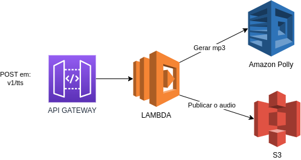
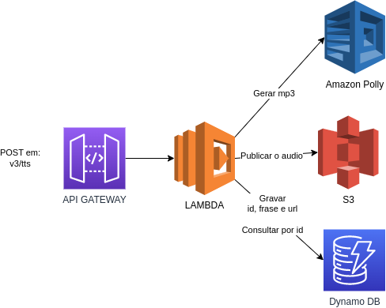

# Projeto de Avaliação - Sprints 4, 5 e 6
 
Este projeto é parte da avaliação das sprints 4, 5 e 6 do programa de bolsas Compass UOL para formação em machine learning para AWS e Moçambique.
 
## Descrição
 
O objetivo deste projeto é criar uma aplicação serverless em Python que converte frases inseridas pelo usuário em áudio MP3 usando o serviço Polly da AWS.
 
## Especificações
 
- **Serviço AWS**: Amazon Polly
- **Framework Serverless**: Serverless Framework
- **Linguagem de Programação**: Python
 
## Estrutura do Projeto
 
- A aplicação foi desenvolvida utilizando o framework serverless.
- A lógica para conversão de texto em áudio foi implementada em Python.
- O deploy da aplicação foi realizado na AWS Cloud.
 
## Desenvolvimento em Equipe
 
- **Equipe**: Equipe 6 - Conversor de Texto para Áudio
- **Membros**: Lírio Manga, Filipe Domingos dos Santos, Carlos Captine Alexandre Mutemba e Aniceto Dinis Munguambe
 
## Instruções para Instalação e Execução
 
### Pré-requisitos
 
- Node.js e npm instalados
- Conta na AWS com permissões para criar recursos como funções Lambda, buckets S3 e tabelas DynamoDB
- Serverless Framework instalado globalmente (npm install -g serverless)
 
### Instalação do Serverless Framework
 
1. Instale o Serverless Framework em seu computador:
 
   ```bash
   npm install -g serverless
   ```
 
2. Gere suas credenciais da AWS (AWS Access Key e AWS Secret) na console AWS pelo IAM. Mais informações [aqui](https://docs.aws.amazon.com/IAM/latest/UserGuide/id_credentials_access-keys.html)
 
3. Insira as credenciais no Serverless Framework executando o comando conforme exemplo:
 
   ```bash
   serverless config credentials \
     --provider aws \
     --key SUA_AWS_ACCESS_KEY \
     --secret SUA_AWS_SECRET_KEY
   ```
 
   Você também pode configurar as credenciais via aws-cli executando o comando:
 
   ```bash
   aws configure
   ```
 
4. As credenciais devem ficar apenas localmente no seu ambiente. Nunca as exponha no README ou em qualquer outro ponto do código.
 
### Deploy da Aplicação
 
1. Para efetuar o deploy da solução na sua conta AWS, acesse a pasta api-tts e execute os comandos:
   
   ```bash
   npm install -g serverless
   ```
   
   ```bash
   npm install serverless-deployment-bucket --save-dev
   ```

   ```bash
   npm install --save-dev serverless-python-requirements
   ```

   ```bash
   serverless plugin install --name serverless-dotenv
   ```

   ```bash
   pip install python-dotenv 
   ```

   ```bash
   pip install boto3
   ```


   ```bash
   serverless deploy
   ```
 
2. Após o deploy, você terá um retorno parecido com isso:
 
   ```bash
   Deploying api-tts to stage dev (us-east-1)
 
   Service deployed to stack api-tts-dev (85s)
 
   endpoints:
     GET - https://xxxxxxxxxx.execute-api.us-east-1.amazonaws.com/
     GET - https://xxxxxxxxxx.execute-api.us-east-1.amazonaws.com/v1
     GET - https://xxxxxxxxxx.execute-api.us-east-1.amazonaws.com/v2
     POST - https://xxxxxxxxxx.execute-api.us-east-1.amazonaws.com/v1/tts
    POST - https://xxxxxxxxxx.execute-api.us-east-1.amazonaws.com/v2/tts
    POST - https://xxxxxxxxxx.execute-api.us-east-1.amazonaws.com/v3/tts
 
   functions:
   health: api-tts-dev-health (230 kB)
   v1Description: api-tts-dev-v1Description (230 kB)
   v2Description: api-tts-dev-v2Description (230 kB)
   v1ttsDescription: api-tts-dev-v1ttsDescription (230 kB)
   v2ttsDescription: api-tts-dev-v2ttsDescription (230 kB)
   v3ttsDescription: api-tts-dev-v3ttsDescription (230 kB)
   ```
 
3. Nosso Resultado
 
## Utilização da Aplicação

### Rota 1 → Get - https://8hlxro3ncg.execute-api.us-east-1.amazonaws.com/

1. O retorno rota é:

```json
  {
    "message": "Go Serverless v3.0! Your function executed successfully!",
    "input": { 
        ...(event)
      }
  }
```

### Rota 2 → Get - https://8hlxro3ncg.execute-api.us-east-1.amazonaws.com/v1

1. O retorno rota é:

```json
  {
    "message": "TTS api version 1."
  }
 
```

### Rota 3 → Get - https://8hlxro3ncg.execute-api.us-east-1.amazonaws.com/v2

1. O retorno rota é:

```json
  {
    "message": "TTS api version 2."
  }

```

### Rota 4 -> Post - https://8hlxro3ncg.execute-api.us-east-1.amazonaws.com/v1/tts

Deverá receber um post no formato abaixo:

```json
  {
    "phrase": "converta esse texto para áudio"
  }
```

- Essa frase recebida é transformada em áudio via AWS Polly
- Depois armazenada em um S3 

Resposta a ser entregue:

```json
  {
    "received_phrase": "converta esse texto para áudio",
    "url_to_audio": "https://meu-buckect/audio-xyz.mp3",
    "created_audio": "02-02-2023 17:00:00"
  }
```

Dessa maneira essa é a arquitetura implantada:




### Rota 5 -> Post - https://8hlxro3ncg.execute-api.us-east-1.amazonaws.com/v2/tts

Deverá receber um post no formato abaixo:

```json
  {
    "phrase": "converta esse texto para áudio e salve uma referencia no dynamoDB"
  }
```

- A frase recebida é transformada em áudio via AWS Polly
- De seguida é armazenada em um S3
- Depois é salva uma referencia no dynamoBD com as seguintes informações: id, frase e url do s3

Resposta a ser entregue:

```json
  {
    "received_phrase": "converta esse texto para áudio",
    "url_to_audio": "https://meu-buckect/audio-xyz.mp3",
    "created_audio": "02-02-2023 17:00:00",
    "unique_id": "123456"
    
  }
```

Dessa maneira essa é a arquitetura implantada:


### Rota 6 -> Post - https://8hlxro3ncg.execute-api.us-east-1.amazonaws.com/v3/tts

Deverá receber um post no formato abaixo:

```json
  {
    "phrase": "converta esse texto para áudio e salve uma referencia no dynamoDB. Caso a referencia já exista me devolva a URL com audio já gerado"
  }
```

- Utiliza a lógica do hash para verificar se a frase já foi gerada anteriormente.
- Caso o hash já exista no dynamo entrega o retorno conforme abaixo.
- Caso não exista faz a geração do audio, grava no s3 e grava as referencias no dynamo conforme Rota 5

Resposta a ser entregue:

```json
  {
    "received_phrase": "converta esse texto para áudio",
    "url_to_audio": "https://meu-buckect/audio-xyz.mp3",
    "created_audio": "02-02-2023 17:00:00",
    "unique_id": "123456"
  }
```

Dessa maneira a arquitetura implantada:


 
## Dificuldades Enfrentadas e Desafios
 
Durante o desenvolvimento deste projeto, enfrentamos algumas dificuldades e desafios:
 
1. **Configuração do Serverless Framework**: No início, tivemos dificuldades para configurar corretamente o Serverless Framework em nossas máquinas. Consultamos a documentação e realizamos algumas pesquisas para superar esse obstáculo.
 
2. **Exposição de Credenciais da AWS**: Uma das principais preocupações foi garantir que as credenciais da AWS não fossem expostas em nosso código ou no README. Seguimos as melhores práticas de segurança para evitar qualquer exposição não intencional.
 
3. **Criação da Rota /v1/tts**: Encontramos um erro "Not Found" ao tentar usar o método POST via CLI. Resolvemos esse problema utilizando o Postman para executar a requisição com sucesso.
 
4. **Configuração do S3, DynamoDB e Polly no Serverless**: A configuração inicial desses serviços no Serverless Framework exigiu um entendimento mais profundo da integração entre eles. Após algumas tentativas e consultas à documentação, conseguimos configurar adequadamente.
 
## Observações sobre Credenciais da AWS
 
É crucial seguir as seguintes práticas para garantir a segurança das credenciais da AWS:
 
- Nunca exponha suas credenciais no README ou em qualquer outro ponto do código fonte.
- Configure suas credenciais localmente em seu ambiente de desenvolvimento, preferencialmente através do arquivo ~/.aws/credentials ou utilizando variáveis de ambiente.
- Não compartilhe suas credenciais com pessoas não autorizadas e mantenha-as em sigilo.
 
**Obrigado por usar a nossa aplicação**
 
- Copyright: Equipe 6 - 2024